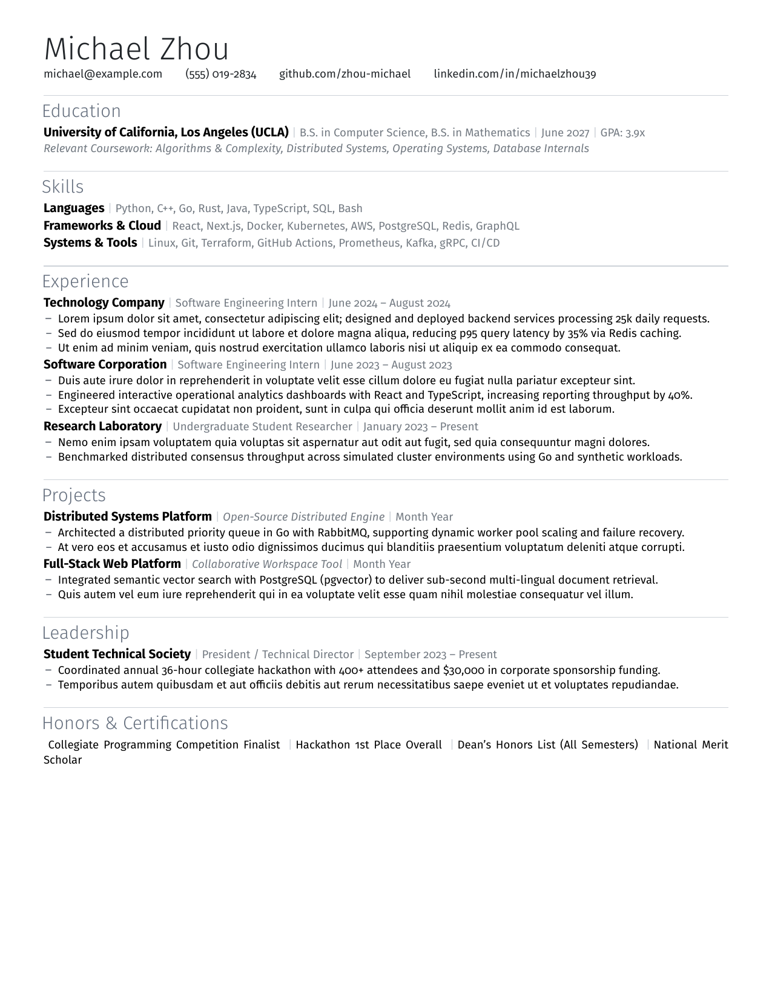
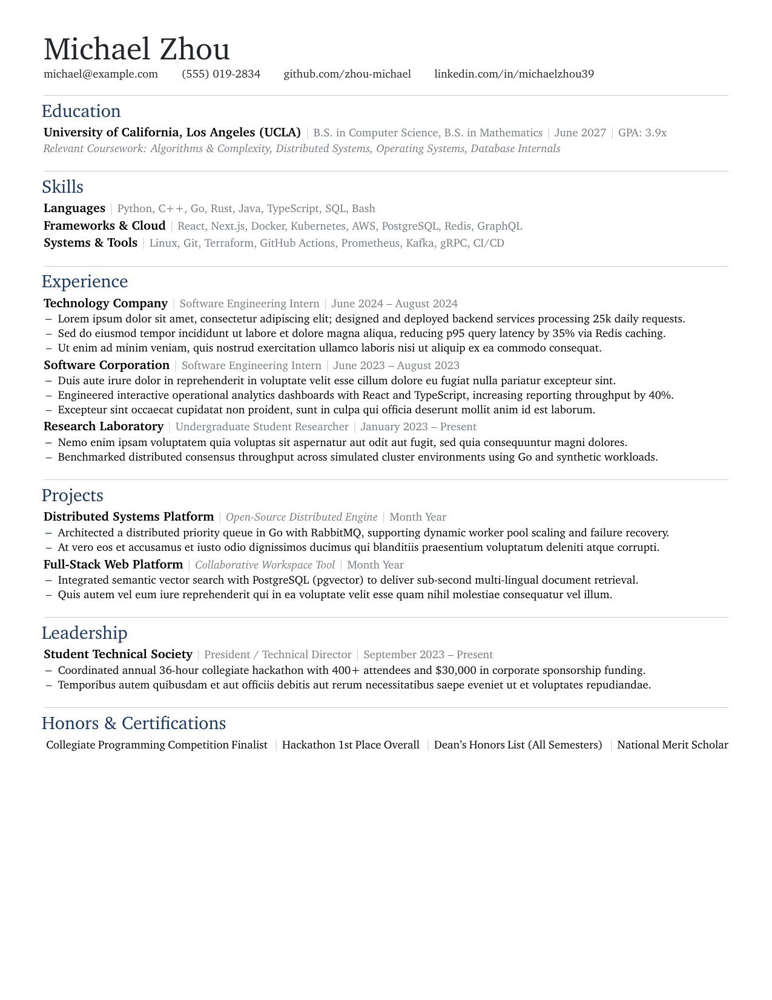
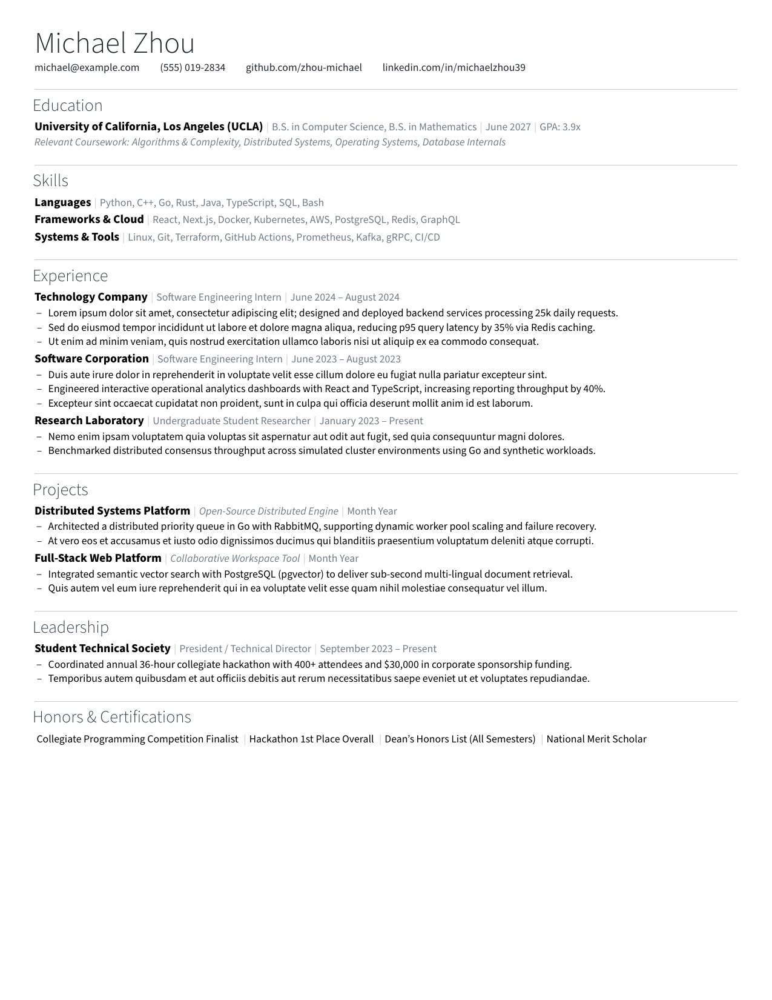
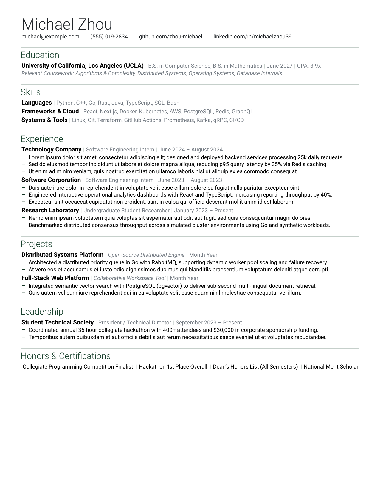

# Michael Resume Template (`michael-resume.cls`)

A modern, minimalist, and ATS-compliant LaTeX resume class and template. Inspired by [`michael.sty`](../dotfiles/common/michael.sty), designed to replace outdated templates like Jake's Resume with clean typography, refined vertical rhythm, and sophisticated aesthetic options.

---

## 📸 Visual Comparison & Design Philosophy

| Design Dimension | Outdated (e.g. Jake's Resume) | **Michael's Resume (`michael-resume`)** |
| :--- | :--- | :--- |
| **Typography** | Computer Modern (academic, thin, harsh serifs) | Fira Sans / Open Sans (modern, light, crisp sans-serif) |
| **Section Dividers** | Clunky black `\titlerule` clamped under title | Subtle section dividers (`divider=rule` or `title`) in soft slate |
| **Palette** | Monochrome pure black & harsh underlined links | Harmonized with `michael.sty` (`midnight`, `slate`, `charcoal`, `forest`) |
| **Entry Layout** | Rigid 2-line `\begin{tabular*}` tables | Flexible `\resumeEntryInline`, `\resumeEntrySplit`, `\resumeProject` |
| **Bullets** | Bulky black circles with deep indent | Sleek en-dash (`--`) with tight hanging indent |
| **ATS Compliance** | Basic unicode mappings | Full `glyphtounicode`, clean ASCII fallbacks, zero multi-column table bugs |

---

## 🖼️ Preset Gallery

The template provides instant pre-configured looks ready to activate by changing the `\documentclass` options in [`resume_template.tex`](resume_template.tex). Click any preview or link to open the PDF directly:

| **Look 1: Modern Tech (Slate / Fira Sans)** | **Look 2: Executive Serif (Midnight / Charter)** |
| :---: | :---: |
| <a href="examples/preview-slate.pdf"></a><br>[📄 View PDF](examples/preview-slate.pdf) | <a href="examples/preview-midnight.pdf"></a><br>[📄 View PDF](examples/preview-midnight.pdf) |
| *Modern tech humanist sans-serif with subtle slate gray accents* | *Distinguished Bitstream Charter serif with deep midnight navy accents* |

| **Look 3: Minimalist Charcoal (Source Sans)** | **Look 4: Modern Fresh (Forest / Roboto)** |
| :---: | :---: |
| <a href="examples/preview-charcoal.pdf"></a><br>[📄 View PDF](examples/preview-charcoal.pdf) | <a href="examples/preview-forest.pdf"></a><br>[📄 View PDF](examples/preview-forest.pdf) |
| *Clean Adobe Source Sans Pro with graphite accents and compact margins* | *Geometric Google Roboto with deep forest green accents* |

---

## 🚀 Quick Start

### 1. Compile with Tectonic
No large packages needed—Tectonic downloads necessary font and package caches automatically:
```bash
git clone https://github.com/zhou-michael/michaels-resume-template.git
cd michaels-resume-template
tectonic resume_template.tex
```

### 2. Using `make`
```bash
make          # Compiles resume_template.tex (and resume.tex if present)
make preview  # Opens the PDF in your default viewer (Zathura on Linux, Skim on macOS)
make watch    # Automatically recompiles on save with live preview
make clean    # Cleans temporary TeX build files
```

### 3. Using `latexmk` (TeXLive)
```bash
latexmk resume_template.tex
```

---

## 🎨 Class Configuration & Options

In your document preamble:
```latex
\documentclass[
  color       = slate,     % midnight (default) | slate | charcoal | forest | monochrome
  font        = fira,      % fira (default) | charter | sourcesans | roboto | inter | helvetica | ...
  divider     = rule,      % rule (default, subtle rule above section) | title (under title) | none
  bullet      = dash,      % dash (default, sleek en-dash) | circle | none
  headeralign = left,      % left (default) | center
  margin      = standard   % standard (0.48in) | compact (0.38in) | relaxed (0.65in)
]{michael-resume}
```

### Color Schemes (Inspired by `michael.sty`)
- **`midnight`** (Default): Deep navy blue accent (`MidnightBlue!70!black`), echoing theorem environments in `michael.sty`.
- **`slate`**: Cool slate/steel gray, directly matching the attached reference resume.
- **`charcoal`**: Subtle dark graphite neutral for modern tech and design applications.
- **`forest`**: Deep forest green accent (`ForestGreen!30!black`).
- **`monochrome`**: Classic pure black and subtle gray for traditional ATS or banking submissions.

---

## 📝 Syntax Reference

### Header
```latex
\name{Firstname Lastname}
\contact{
  \email{user@example.com} \hfill
  (555) 000-1234 \hfill
  \web[linkedin.com/in/user]{linkedin.com/in/user} \hfill
  City, State
}
\makeheader
```

### Inline Piped Entry (Recommended for clean single-line density)
```latex
\begin{resumeSection}{Education}
  \resumeEntryInline{UCLA}{B.S. Computer Science, B.S. Mathematics}{June 2027}{GPA: 3.92}
  \resumeNote{\textit{Coursework: Deep Learning, Distributed Systems, Compilers, Operating Systems}}
\end{resumeSection}
```

### Bullet Points
```latex
\begin{resumeItemList}
  \resumeItem{Designed and implemented high-throughput semaphore scheduler, eliminating service stalls.}
  \resumeItem{Scaled Kubernetes infrastructure across node clusters, improving query latency by 40\%.}
\end{resumeItemList}
```

### Skills & Competencies
```latex
\begin{resumeSection}{Skills}
  \resumeSkillGroup{Languages}{Python, C++, Go, Rust, TypeScript, SQL, Bash}
  \resumeSkillGroup{Tools}{Docker, Kubernetes, PyTorch, ROS, React, Next.js, Git}
  \resumeSkillGroup{Systems}{Distributed Computing, LLM Inference, Linux Kernel, Robotics}
\end{resumeSection}
```

### Awards
```latex
\begin{resumeSection}{Awards}
  \resumeInlineList{
    Putnam Top 500 (\textit{rank 374}) \pipe
    USACO Gold Division \pipe
    AIME 4x Qualification \pipe
    National Merit Scholarship Finalist
  }
\end{resumeSection}
```

---

## ⚡ Zathura & Neovim Integration

Zathura is pre-configured in `~/.config/zathura/zathurarc` with:
- **Catppuccin Mocha** color palette.
- **`i`** or **`Ctrl+r`**: Toggle Catppuccin Dark Mode / Authentic Light Mode.
- **SyncTeX forward and inverse search**:
  - `Ctrl + Left Click` in Zathura jumps directly to that line in Neovim.
  - In Neovim with VimTeX: `\lv` jumps directly to that line in Zathura.
